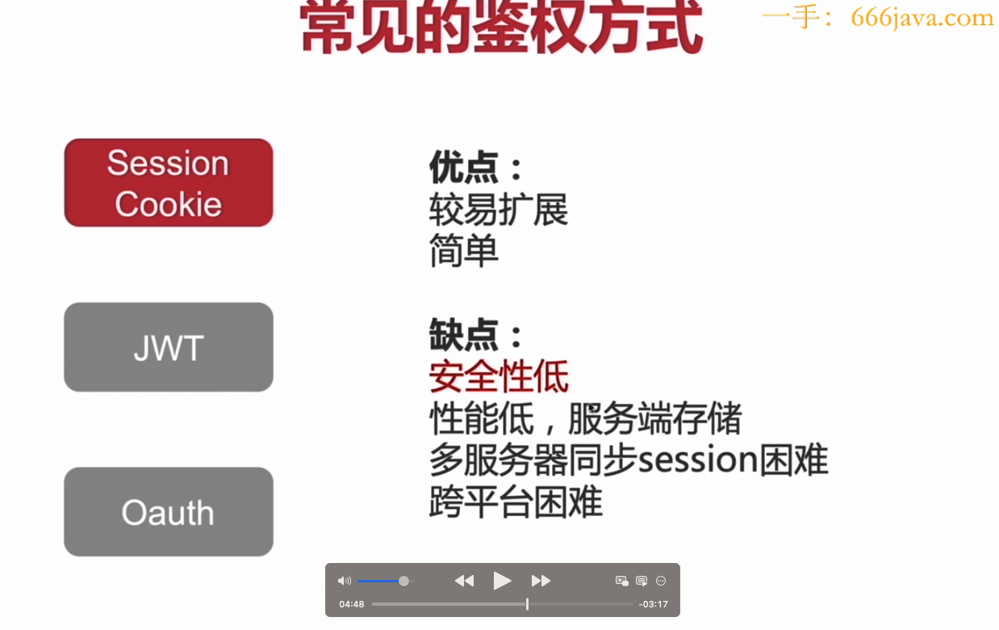
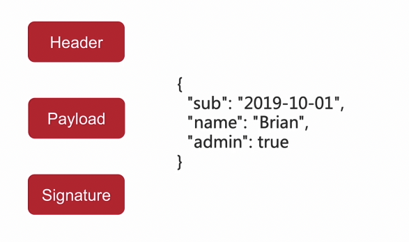

# nestjs服务端开发：通用业务框架设计

项目需求分析前，请思考：
- 我们的项目杨素最痛点的问题是什么？是角色设计？
- 用户的功能的最小闭环是什么？内容查询&筛选？
- 辅助最小闭环的实现到项目上线，需要什么技术&方案

项目需求分析
- 接口服务：提供可靠、可扩展的web服务，集成数据库+redis
- 实现最小闭环：接口CURD、登录注册（认证）、权限控制（鉴权）
- 服务部署与测试：提供文档（需求、测试、部署、产品）

项目技术栈
- Nestjs+TypeScript作为后端
- ORM库：TypeORM
- Bootstrap5.x+Vue作为前端

开发思路：由简入繁，最小闭环为主

## 通用后端框架设计：需要考虑4大块内容

通用后端框架思考
- 从开发层面思考
- 从功能层面思考
- 从接口安全层面的思考

配置模块日志模块 数据库模块

## 多环境配置方案比较：dotenv与config
dotenv下载量多 使用的是键值对的方式
config下载量少一点 可是使用json、yaml等格式 可以使用对象方式书写
嵌套类型的数据前缀可以使用对象属性
SITE_NAME
SITE_AGE

使用joi对配置文件进行校验

@nestjs/config可以实现dotenv和config读取yaml文件的功能 
但是读取json还是需要config来读取，并且他是有默认设置的 也就是默认会读取config/production.json文件 并且会默认合并文件

## Nestjs配置模块：多环境配置读取、配置校验joi

## 数据库设计三大范式

### 第一范式
1NF是对属性的原子性，要求属性具有原子性，不可再分解（不能有嵌套的结构）

高级职称人数包含了教授和副教授  这样就不符合标准了 应该是再继续分解为最小单位

### 第二范式
2NF是对记录的唯一性，要求记录有唯一标识，即实体的唯一性，即不存在部分依赖

就是说抱这个表里面的所有数据都是没有相互依赖关系的

比如说职工号和姓名就是重复的 一个姓名只能有一个职工号 这个就有了依赖关系 这样就不行了

### 第三范式
如果一个关系属于第二范式，并且在两个非主键属性之间不存在函数依赖，非主键属性之间的函数依赖也称为传递依赖，那么这个关系属于第三范式

比如说下面的学号和学生其实是有个依赖关系的 虽然不是直接的 学号可能是属于某个学院的 比如说学号里面有001 对应的是教育学院 002 对应的是...

## 通过已经有的数据库逆向形成实体类

安装typeorm-model-generator 使用 但是安装它需要python3 所以就没用

## 日志系统

- 什么事件发生的
- 发生了什么事情
- 错误是什么

常见日志及获取（记录）方式（常见的操作日志）
第三方日志方案winston（勤快的人）pino（推荐懒人）（写到服务器上的日志）
通用业务系统日志系统配置（学习定时任务）（怎么集成日志方案）

### 日志等级

- Log:通用日志，按需进行记录  （打印）
- Warning：警告日志 比如：尝试多次进行数据库操作
- Error：严重日志：比如：数据库异常
- Debug：调试日志，比如：加载数据日志
- Verbose:详细日志，所有的操作与详细信息

### 功能分类日志
错误日志>方便定位问题，给用户友好的提示
调试日志>方便开发
请求日志>记录敏感信行为

### 日志记录位置

控制台日志 方便监看（调试用）
文件日志 方便回溯与追踪（24小时滚动）
数据库日志 敏感操作、敏感数据记录

### Logger
官方自带的logger 只能打印在控制台中 开发使用

### pino

请求后默认会打印一次日志  所以说非常的适合懒人

但是输出的打印日志 非常的丑  我们可以格式化一下 需要安装 pino-pretty这个包

### winston
winston 并不能全局的注册 后在每个模块中使用 每个模块要使用的话得重新注册一下才行 
当接口发生了错误的时候，我们不能每个接口都使用trycatch捕获错误 发生错误的时候调用logger记录    这样太麻烦了 
nest由一个总的trycatch来记录

## 路由参数获取

@Query() 括号里面传参数就是解析这一个参数 如果什么都不传的话 就是获取到所有的query参数了

@Get('/:id') 和@Get('/profile')  这两个路由冲突了 如果profile在后面的话 会被上面的:id路由所拦截  要不就把profile路由放到id的上面  要不就把id的改为@Get('/info/:id')

前端Query传递过来的参数都是string类型的

nest g f filters/typeorm --flat -d

## JWT
JWT的全称是JSON Web Token,一个JWT由三部分构成，Header Payload SIgnature

Header 规定了加密的方式和加密的类型

包含的一些用户的信息

Signature就是Header的base64的值+payload的base64的值 再加上SIgnature的一个字符串

### JWT特点
防止CSRF（主要是伪造请求，带上Cookie）
适合移动应用 因为移动应用没有Cookie  Cookie是在浏览器上存储的
无状态 编码数据

没有绝对的安全 只有相对的安全

## 算法加密

数据加密的基本过程，就是对原来为明文的文件或数据桉某种算法进行处理，使其称为不可读的一段代码，通常称为密文，通过这样的途径，来达到保护数据不被非法人窃听阅读的目的。

